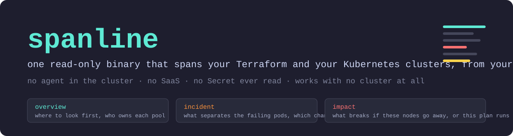
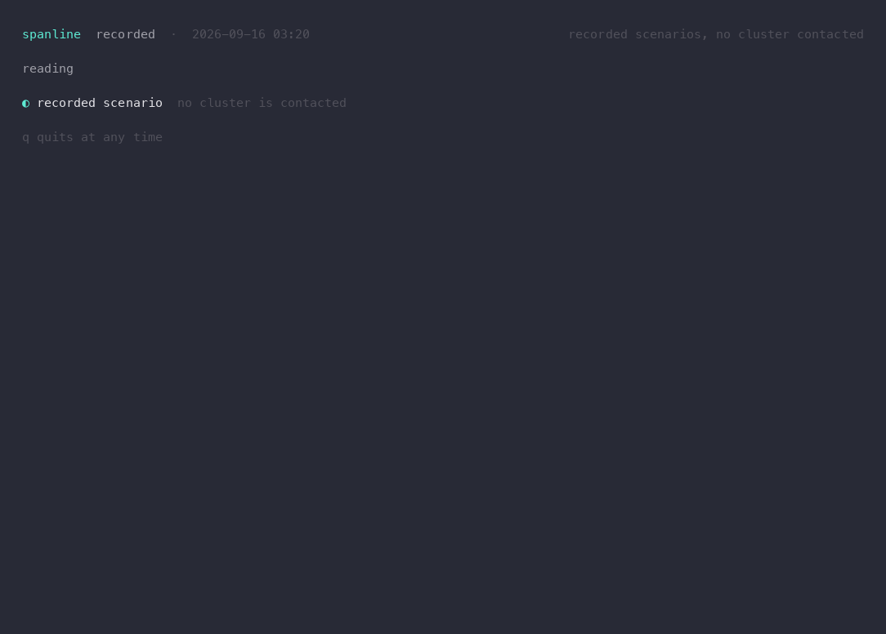
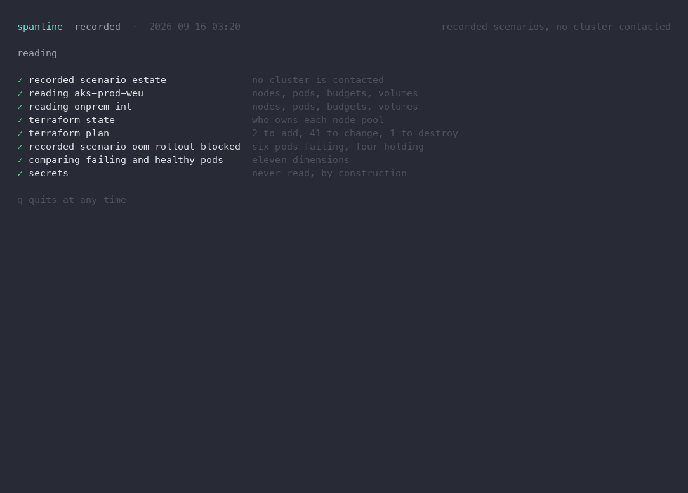
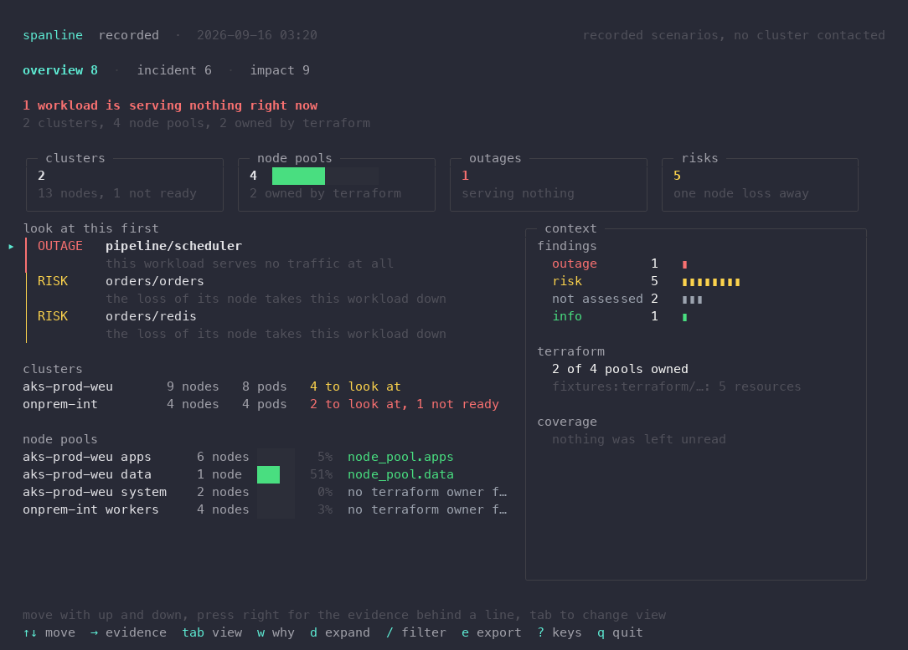
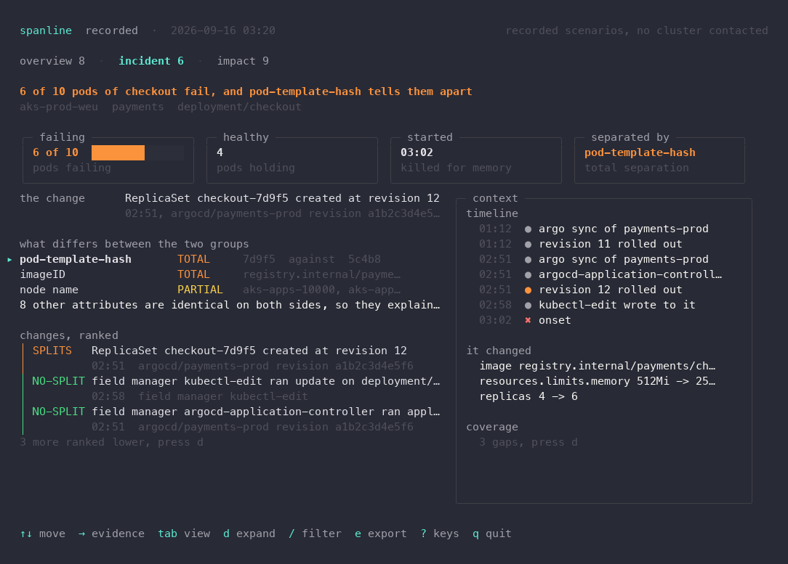
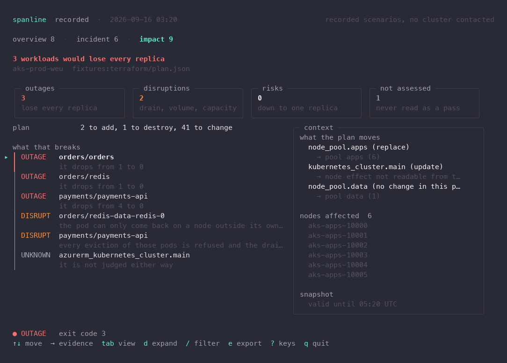
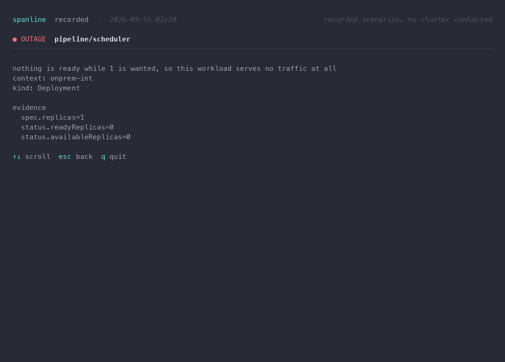
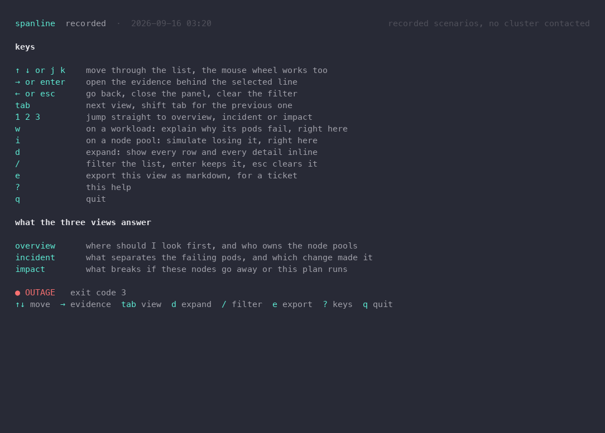
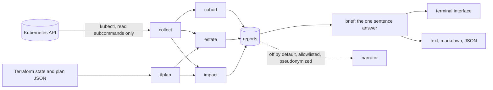

<p align="center">
  
</p>

<p align="center">
  <a href="https://github.com/arnocho/spanline/actions/workflows/ci.yml"></a>
  <a href="go.mod"></a>
  <a href="LICENSE"></a>
  <a href="https://pkg.go.dev/github.com/arnocho/spanline"></a>
  <a href="docs/security-review.md"></a>
  <a href="docs/security-review.md"></a>
</p>

**spanline** is one read-only binary that spans your Terraform and your Kubernetes clusters, from
your laptop. It answers three questions a platform engineer asks every week, and it answers each
one on a single screen: where should I look first, what separates the pods that fail from the pods
that hold, and what breaks if these nodes go away or this plan runs.

No agent in the cluster. No SaaS. No server. It reuses the credentials already on the machine, only
ever runs read subcommands, and never reads a Secret. Four recorded scenarios are embedded in the
binary, so you can try every screen with no cluster at all.

<p align="center">
  
  <br>
  <sub>The same walkthrough as a video: <a href="docs/demo.mp4">docs/demo.mp4</a>. Both are generated from the code, see <a href="docs/recording.md">docs/recording.md</a>.</sub>
</p>

## Contents

- [Try it in one minute](#try-it-in-one-minute)
- [The three screens](#the-three-screens)
- [Tutorial: the first fifteen minutes on a real cluster](#tutorial-the-first-fifteen-minutes-on-a-real-cluster)
- [Keys](#keys)
- [Exit codes](#exit-codes)
- [How it works](#how-it-works)
- [What it reads, and what it never does](#what-it-reads-and-what-it-never-does)
- [Air-gapped sites](#air-gapped-sites)
- [The optional narrator](#the-optional-narrator)
- [Development](#development)
- [Status](#status)
- [Licence](#licence)

## Try it in one minute

Install from source, which is also the only supported path on a restricted site:

```bash
go install github.com/arnocho/spanline/cmd/spanline@latest
```

Then open the interface on the recorded scenarios. Nothing is contacted, nothing leaves the
machine:

```bash
spanline demo
```

Press `?` at any time for the keys. Press `q` to leave.

The interface opens by naming every read it performs, which is also the shortest explanation of
what the tool touches and what it deliberately never touches:

<p align="center"></p>

## The three screens

On a terminal at least 104 columns wide, each screen is a dashboard: a row of tiles that count up
as the view arrives, the list you navigate on the left, and a context panel on the right. Narrower
terminals get the same content in one column. On a live cluster the cockpit reloads itself every
30 seconds, with a countdown in the header, and says in one line what changed.

### overview: where should I look first

The prioritised findings, then one line per cluster, then one line per node pool with the
Terraform address that owns it. Nothing fragile is hidden behind a table.

<p align="center"></p>

From here, `w` on a workload opens its incident and `i` on a node pool simulates losing it,
without leaving the application.

### incident: what separates the failing pods

Give it a workload. It splits the pods into failing and healthy, compares them across template
hash, image, node, pool, node image, kernel, kubelet, runtime, zone and config checksum, names the
dimension that tells them apart, and ranks changes by whether they created that dimension. The
timeline puts every change next to the moment the failure started.

<p align="center"></p>

When every pod is failing there is no healthy cohort left, so it falls back to comparing the
current controller revision with the previous one, and says that the verdict is weaker. Verdicts
are `SPLITS`, `TEMPORAL`, `NO-SPLIT` and `UNKNOWN`. The word "cause" is never printed, and a test
fails if it ever is.

### impact: what breaks if this happens

Simulate the loss of a pool, a zone or a node list, or feed it the plan your CI exported, and see
which workloads lose every replica, which disruption budgets block the drain, which volumes are
stranded and whether the load fits on what survives. The verdict and the exit code stay pinned at
the bottom.

<p align="center"></p>

### the evidence behind any line

Every finding carries the exact fields it was derived from. Press the right arrow on a line to read
them.

<p align="center"></p>

## Tutorial: the first fifteen minutes on a real cluster

Everything below reads through the `kubectl` already on your machine, with the context you have
selected, under your own identity.

**1. See what the tool would touch before it touches anything.**

```bash
spanline doctor
```

This prints the identity in use, whether it can write (spanline never will, but the security team
wants to know), every endpoint the run will contact, and the audit footprint the API server will
record. Add `--profile strict` to refuse to run with an identity that can write or read Secrets.

**2. Open the cockpit on the clusters that matter.**

```bash
spanline cockpit --contexts 'prod-*' --tfstate ./infra/state.json
```

Contexts are globs over your kubeconfig. Each `--tfstate` is a state file you already have; only
identity is read from it, never attribute values, so a state holding secrets is not disclosed. With
no state, node pools show "no terraform owner found" instead of a guess. The cockpit reloads every
30 seconds; `r` reloads now, and `--refresh 0` turns it off.

**3. Explain an incident.**

```bash
spanline why deploy/checkout -n payments
```

The screen leads with what separates the failing pods and the change that created it. `d` expands
the eleven dimensions and every ranked change; the right arrow opens the evidence behind a line.
For a ticket:

```bash
spanline why deploy/checkout -n payments --md > incident.md
```

Markdown carries everything. Plain text (`--no-tui`) carries the short answer, and `--details` adds
the full report back.

**4. Rehearse a change before making it.**

```bash
spanline impact --nodes pool=apps
```

Other selectors: `zone=2`, `node=name1,name2`, `label=key=value`, or a bare list of node names.

**5. Gate a Terraform apply on what it would break.**

Have the pipeline export the plan, then let spanline read it. The plan JSON never contains
credentials, and spanline never runs `terraform`:

```bash
terraform show -json plan.tfplan > plan.json
spanline impact --plan plan.json --tfstate ./state.json --no-tui --md > impact.md
```

The exit code is the gate. A GitLab job that fails only on an outage and leaves risks for review:

```yaml
impact:
  stage: plan
  script:
    - terraform show -json plan.tfplan > plan.json
    - spanline impact --plan plan.json --context "$KUBE_CONTEXT" --no-tui --md > impact.md
  allow_failure:
    exit_codes: [1, 2]
  artifacts:
    paths: [impact.md]
    when: always
```

**6. Keep the answer.**

Inside the interface, `e` writes the current view as markdown next to you, named after the view and
the time. Outside it, `--json` prints the report for anything downstream.

## Keys

| key | what it does |
| --- | --- |
| up and down, or the mouse wheel | move through the list |
| right or enter | open the evidence behind the selected line |
| left or esc | back, close the panel, clear the filter |
| tab, shift tab | next view, previous view |
| 1 2 3 | jump to overview, incident or impact |
| w | on a workload: open its incident, right here |
| i | on a node pool: simulate losing it, right here |
| d | expand: every row and every detail, inline |
| / | filter the list, enter keeps it, esc clears it |
| e | export this view as markdown |
| r | on a live cockpit: reload now |
| ? | the key map, and what each view answers |
| q | quit |

<p align="center"></p>

## Exit codes

`impact` is meant to sit in a pipeline, so its exit code is part of the contract:

| code | meaning |
| --- | --- |
| 0 | nothing in the scope that was read would break |
| 1 | a risk was found, or something could not be assessed, which is never a pass |
| 2 | a disruption: a budget blocks the drain, a volume is stranded, the load does not fit |
| 3 | an outage: at least one workload loses every replica |
| 4 | the run itself failed: context unreachable, permission refused, unreadable input |

## How it works



Three analyses produce reports. Every surface, the interface and the plain output alike, reads the
same one-sentence answer from the same place, so they can never disagree. The analyses are
deterministic: they take the time as a parameter, sort everything, and never call a model. Anything
unread or unmodelled is reported as `NOT ASSESSED`, never as a pass.

The interface itself is testable without a terminal. Every screen can be rendered at any instant
of its animation, which is how the screenshots above, the walkthrough and the test suite are all
produced from the same code.

## What it reads, and what it never does

Reads, through your own `kubectl`, with an allowlist of exact read subcommands enforced in code:
`get` (never Secrets, never `--raw`), `config view`, `config get-contexts`, `config
current-context`, `auth can-i`, `auth whoami`, `version` and `api-resources`, with impersonation
flags refused. What it gets: pods, nodes, replicasets, controllerrevisions, deployments,
statefulsets, daemonsets, events, disruption budgets, volume claims, volumes, and Argo CD
applications when present. Reads Terraform or OpenTofu JSON you already have: a state file, or a
plan exported by your pipeline.

Never writes, never patches, never evicts, never impersonates. Never reads Secrets, so Helm release
storage stays untouched and Helm ownership is inferred from the `meta.helm.sh` annotations instead.
Never runs `terraform`, so no provider is downloaded and no backend is contacted. No telemetry, no
update check, no cache of cluster objects on disk.

The one page written for a client security team, with the file that enforces each promise, is
[docs/security-review.md](docs/security-review.md).

## Air-gapped sites

Mirror the source into your own forge, build it there, sign it with your key, and publish it in your
own artifact repository. `go mod vendor` works offline. `make airgap` builds with the hosted
narrator backends left out of the binary entirely, so the only model endpoint it can ever reach is
one you host and allowlist yourself.

## The optional narrator

Off by default. `--explain` sends an allowlisted, pseudonymized payload: field paths, counts,
severities, verdicts, and before and after values limited to resource limits, replica counts, image
tags, node image, kernel, kubelet and zone. Namespaces, workloads, nodes and images are replaced by
placeholders before anything leaves the machine and rehydrated locally in the answer. Every
sentence must cite a field that exists in the payload, with matching numbers, or it is dropped. The
answer is labelled unverified, and it can never change a verdict, an order or an exit code.

```bash
spanline why deploy/checkout -n payments \
  --explain --llm openai-compat --base-url http://vllm.internal:8000/v1 \
  --model your-model --allow-host vllm.internal --api-key-env SPANLINE_API_KEY --show-prompt
```

`--show-prompt` prints the exact bytes that would be sent. Redirects are refused, so an allowlisted
host cannot forward the payload elsewhere.

## Development

```bash
make build      # the binary, with the version stamped from git
make test       # every package, with the recorded scenarios as golden inputs
make airgap     # the reduced binary, hosted backends compiled out
make fixtures   # regenerate the recorded scenarios (Python, deterministic, committed)
make record     # docs/demo.gif and docs/demo.mp4, from the code, no browser
make stills     # one PNG per screen for this README, cut from a recording
```

The four scenarios under `internal/fixtures/data` are generated by `scripts/make_fixtures.py`,
committed as plain JSON, embedded in the binary, and used by the tests. Every analysis rule has a
scenario or a hand-built snapshot that exercises it, and the interface is tested from 40 to 200
columns, including the empty states and the whole keyboard loop.

To review a screen without a terminal:

```bash
SPANLINE_FRAME_DIR=/tmp/frames go test ./internal/ui/ -run TestDumpFrames
```

Contributions are welcome. The rules that keep the tool acceptable on a client machine are not
negotiable and are listed in [CONTRIBUTING.md](CONTRIBUTING.md).

## Status

Early, and honest about it. Every package has been through an adversarial audit with a failing test
before each fix, static analysis and the vulnerability scanner are clean, and the analyses are
covered against recorded scenarios. They have not yet been validated against a live cluster or a
corpus of replayed incidents. Treat the verdicts as evidence to read, not as an answer to act on,
until that corpus exists.

Prior art worth knowing: Radar is the strongest local Kubernetes change timeline, Steampipe can
query Terraform files and clusters side by side in SQL, Overmind maps a plan onto live dependencies
through its own service, and kubectl-revisions diffs controller revisions. spanline's bet is the
join between the two halves, plus the cohort separation, from one binary with nothing to install.

## Licence

Apache-2.0.
